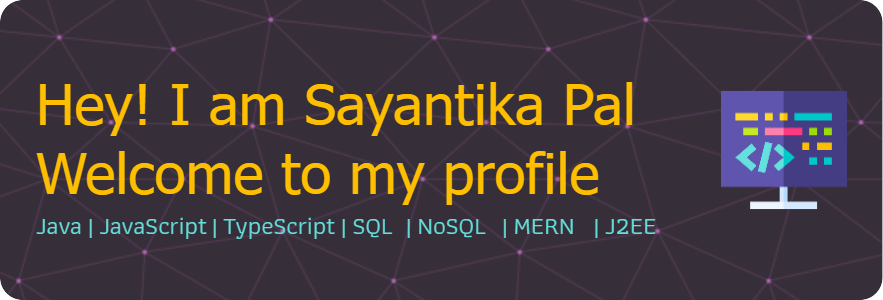

## About Me 

I'm a Software Engineer committed to continuous learning and upskilling, especially in the field of Full Stack Engineering. I'm passionate about building socially impactful projects that can address and contribute meaningfully to pressing issues. Throughout my career and ongoing Master's education, I've developed expertise in building both server-side and client-side web applications, designing and managing databases, and designing RESTful APIs. I have also collaborated with diverse customers in the Financial Services sector and cross-functional teams and have experience with the end-to-end software development lifecycle.
  

## Technical Projects 
Here are some of my projects that demonstrate the range of my focus areas.

## Technology Stack 

### Languages

### Back-end Development

### Front-end Development

### DevOps

 

## Current Engagement 

- Enhancing my skills in AWS services by completing the **AWS Certified Developer - Associate** online course on Udemy
- Learning Ukulele 🪕

 
<!-- <footer align="center">
  <h4 style="color: rgb(79, 36, 122);">Profile Views</h4>
  

  

  

  

</footer> -->

