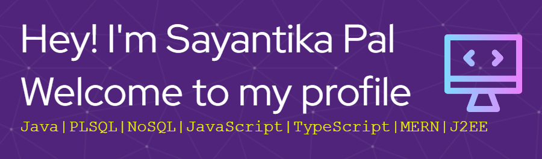
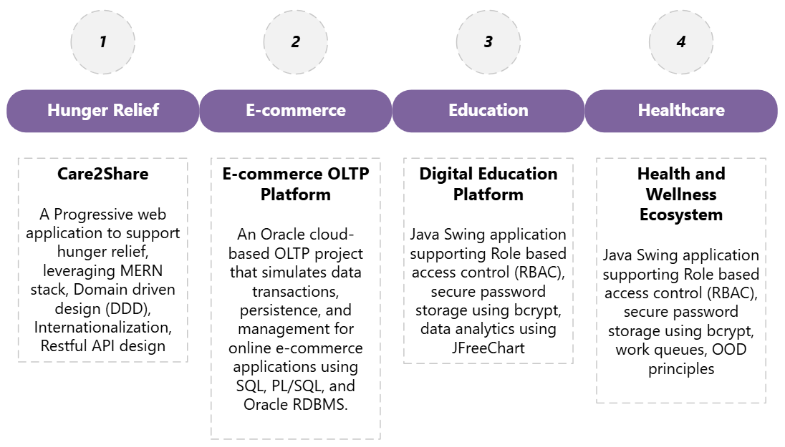

# About Me
I'm a Software Engineer committed to continuous learning and upskilling especially in the field of Full Stack Engineering. I'm passionate about building socially impactful projects that can address pressing issues.
Moreover, I truly appreciate a good sense of humour! 
  

# Technical Projects
Here are some of my projects that demonstrate the range of my focus areas.

 

# Current Engagement

Enhancing my skills in AWS services by completing the **AWS Certified Developer - Associate** online course on Udemy

  
<!--  -->
<footer align="center"> 
  <h4 style="color: rgb(79, 36, 122);">Profile Views</h4>
  

  

  

<h3 style="color: rgb(79, 36, 122);"><i>Thank you for visiting ! </i></h3>
  

</footer>